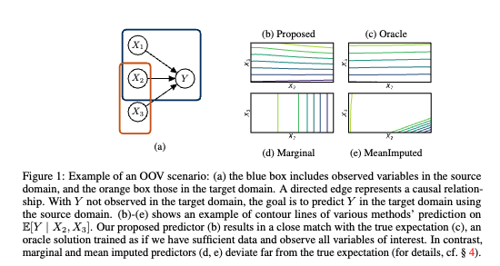

# Out-of-Variable Generalization for Discriminative Models

This code contains the official implementation of 

Siyuan Guo, Jonas Wildberger, Bernhard Schölkopf - [Out-of-Variable Generalization for Discriminative Models](https://arxiv.org/abs/2304.07896)

This work highlights the efficiency to not observe joint variables for target inference task.
In practice, to measure and observe all variables is difficult and costly. 
This is akin to the process of animate learning: we, too, explore Nature by probing, observing, and
measuring proper subsets of variables at any given time.

### Toy Example
Suppose we aim to recover the joint distribution 

```math
P(X_1, X_2, ... , X_n)
```
Instead of observing all the variables at the same time, $`X_1, X_2, ..., X_n`$, 
it is sufficient if we know the Markov Factorization, we observe $`X_i, PA_i`$ in i-th environment. 

```math
P(X_1, X_2, ... , X_n) = \prod_i P(X_i | PA_i)
```

### Problem Setup



Consider an SCM with additive noise $`Y:= \phi(X_1, X_2, X_3) + \epsilon`$ with jointly independent causes and normal noise. 
Assume that we do not have access to an environment jointly containing all variables $`X_1, X_2, X_3, Y`$. Instead, we have
a source environment with jointly observed $`X_1, X_2, Y`$, and a target environment with jointly observed $`X_2, X_3`$, and unobserved $`Y`$.
The goal is to predict $`Y`$ given $`X_2, X_3`$.

**Intuition** We recover the relationship between $`Y`$ and $`X_3`$ through noticing $`X_3`$ through unobserved in the source is a generating factor of $`Y`$.
Its information is not contained in the marginalized mean but also in the residual distribution of the error after fitting a discriminative model. 
Thus by modelling the residual distribution from the source environment, we devise an algorithm to perform out-of-variable prediction in the target environment. 

**Results** We found our method outperforms marginal baseline, MeanImputed baseline and close to the oracle solution when the underlying relationship follows certain functional relationship. 


## How to run the code

After installing the package (`pip install .`), the experiments folder:

* Get the contour plots in Fig 1 (b) - (e)

   `zero_shot_learning.ipynb`
* the real-world experiment in Table 2

   `python real_world_dataset.py`
* systematic analysis on MomentLearn's (our method) performance with respect to increasingly more complex function classes

   `python ablation_studies.py`
* quantitative results on sample efficiency in Figure 3

   `python quantitative_result.py`
* robustness analysis on MomentLearn's performance with respect to varying noise scale in Table 3

    `python ablation_studies_with_noise.py`
* robustness analysis when the noise is heavy-tailed, i.e., lognormal distribution with mean 0 and sigma 0.5 in Table 4

    `python ablation_studies_w_heavy_tailed.py`

